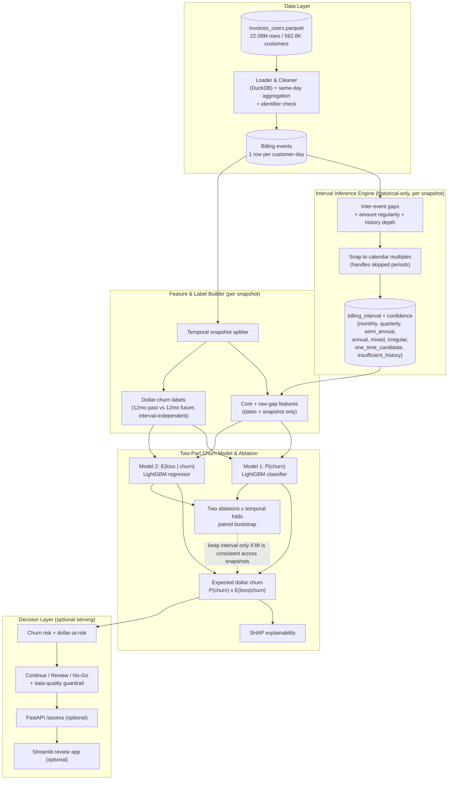

# Solution Blueprint: Inferring Billing Intervals to Improve Dollar-Churn Prediction

> **Scope note:** This blueprint solves **Task 3 — The Billing / Invoice Problem**. It is grounded in the actual `Invoices_users.parquet`: **22,083,629 invoices across 562,851 customers**, spanning **2023-01-09 → 2026-04-05** (~39 months). Columns: `id`, `account` (constant `"main"`), `accountid` (constant `"511_main"`), `customerid`, `amount` (float; median 1.0, mean 10.8, max 11,880), `date` (datetime).
>
> **Verified data facts that drive the design:**
> - **`customerid` is already unique** — 562,851 customers, `accountid` is a single constant value, and every customer maps to exactly one `accountid`. The composite `(accountid, customerid)` key is unnecessary here but retained as a defensive check for future integrations (see §4, Loader).
> - **17.2% of `(customerid, date)` pairs contain more than one invoice** (some customer-days hold thousands). Same-day invoices must be aggregated into a single billing event before computing gaps.
> - **62% of customers have exactly one invoice** (median invoices/customer = 1, 75th pct = 2); a few have thousands (max 9,387). Single-invoice customers are therefore split into `insufficient_history` vs `one_time_candidate` rather than blanket-labeled `one_time`.

---

## 1. Problem Statement

The credit model needs each customer's **billing interval** (monthly, quarterly, semi-annual, annual, or one-time) as a revenue-quality signal, but that field is frequently missing at first integration because the customer's CRM/accounting system isn't fully connected. This blocks an immediate **Continue / No-Go** credit decision and slows onboarding.

We will (1) **infer the billing interval** for each customer from raw invoice dates and amounts using an explainable, historical-data-only rule engine (there is no ground-truth interval to train against), (2) **define and predict dollar churn** — revenue lost — with a target that is deliberately **independent of the inferred interval**, and (3) **measure the interval's incremental predictive value** with controlled, temporally-validated ablations. If adding the interval consistently improves the churn model without degrading calibration or key segments, it is "good enough" to substitute for the missing real interval and unblock the decision.

**Out of scope / de-prioritized:** the LLM credit agent and landlord model (Tasks 1–2); enrichment from Companies/Landlords tables (churn signal is derived from invoice history only); real-time streaming. **FastAPI, Streamlit, Docker, and MLflow are optional extensions** — the graded core is data analysis → interval inference → dollar-churn definition → leakage-safe features → ablation → business conclusions.

---

## 2. AI Approach

**Chosen approach:** A two-stage classical pipeline — **(a) unsupervised, rule-based interval inference** from same-day-aggregated inter-invoice gaps, amount regularity, and history depth, feeding **(b) a two-part (frequency–severity) dollar-churn model**, evaluated by **temporally-validated, paired-bootstrap ablations** and explained with **SHAP**.

**Why this approach:**
- **No ground truth for the interval** rules out supervised interval classification. The interval is a latent property of a periodic point process; the auditable way to recover it is to measure the spacing of billing events and its regularity, then match to the nearest canonical calendar period (allowing for *skipped* periods). Every output is a traceable number the credit team can audit.
- **Two-part churn modeling** separates two distinct questions the business actually asks: *will* the customer churn, and *how much* revenue is lost *if* they do. Expected dollar churn `= P(churn) × E(loss | churn)` is more interpretable and better-calibrated on this heavily right-skewed monetary data than a single regression that must model both at once.
- **The core question is incremental predictive value, not causality.** The clean way to answer "is the inferred interval good enough?" is a **paired ablation** (identical pipeline, one feature group toggled) validated **across temporal snapshots** with a significance test — a design the pipeline is built around from the start.

**Approaches considered and ruled out:**

| Approach | Why ruled out |
|----------|--------------|
| LLM / RAG to "read" invoices and name the interval | Overkill and non-deterministic for date arithmetic; not auditable; unvalidatable without ground truth; slow/costly at 562K customers. The signal is numeric, not linguistic. |
| Supervised interval classifier | **No label** exists; any labels would be generated by the very rules we'd be learning — circular. |
| FFT / Lomb–Scargle periodogram per customer | Useless for the single-invoice and short-history majority; heavier and less explainable than gap-based rules. Retained only as an optional confidence cross-check for high-volume customers. |
| Deep sequence models (RNN/Transformer) | No labels, extreme length/volume imbalance, zero interpretability payoff over trees; indefensible to a credit committee. |
| Single-model dollar-churn regression | Must simultaneously fit "who churns" and "how much" on skewed data; worse calibration and interpretability than the frequency–severity split. Kept only as a baseline. |

---

## 3. System Architecture



**Architecture narrative:** A linear batch pipeline; the one loop that matters is the **ablation feedback** — the interval feature group earns its place only if it lifts the model **consistently across temporal snapshots** without harming calibration. The expensive 22M-row pass happens once, in the loader, which also aggregates same-day invoices into billing events so every downstream gap calculation is correct. Interval inference and feature building are both re-run *per snapshot* using only pre-snapshot history, which is what keeps the whole thing leakage-safe.

---

## 4. Component Breakdown

### Loader & Cleaner
- **Role:** Read the parquet; verify the customer identifier; **aggregate same-day invoices** (sum `amount`, collapse to one billing event per `customerid`-`date`); sort events; guard non-positive amounts.
- **Technology:** **DuckDB** over parquet (out-of-core), materialized to **Polars**.
- **Why this tech:** DuckDB aggregates 22M rows without loading them into RAM; 17% of customer-days are multi-invoice, so this step is load-bearing, not cosmetic.
- **Key interfaces:** In: `Invoices_users.parquet`. Out: `billing_events.parquet` (one row per customer-day: summed amount, date), plus an identifier-uniqueness report (`customerid` vs `(accountid, customerid)`).
- **Failure modes:** Skipping same-day aggregation would inflate invoice counts and produce spurious 0-day gaps, corrupting every interval. Schema drift fails fast via assertion.

### Interval Inference Engine
- **Role:** Assign each customer, **as of a given snapshot**, a `billing_interval ∈ {monthly, quarterly, semi_annual, annual, mixed, irregular, one_time_candidate, insufficient_history}` plus a `[0,1]` confidence — using **only events before the snapshot**.
- **Technology:** Vectorized NumPy/Polars rules; no model.
- **Why this tech:** Deterministic, auditable, instant; every label reduces to "median gap ≈ 31 days ⇒ monthly."
- **Key interfaces:** In: pre-snapshot billing events per customer. Out: `interval_table` keyed by `(customerid, snapshot_date)`.
- **Failure modes:** Single-event customers are **not** blanket-`one_time`: a recent lone invoice is `insufficient_history`; a lone invoice with a long silent tail before the snapshot is `one_time_candidate`. This is the majority path (62%), handled explicitly.

**Derivation logic (auditable core), per customer per snapshot:**
1. Use only events with `date < snapshot`. If **0 events** → excluded from that snapshot.
2. **1 event:** if time since that invoice ≥ a "one-time horizon" (e.g. ≥ 400 days of silence) → `one_time_candidate`; else → `insufficient_history` (too recent to tell). Confidence scales with how much silence has been observed.
3. **≥2 events:** compute gaps `d_i = date_{i+1} − date_i` (days) on aggregated events; take robust center `g = median(d_i)`.
4. **Match to calendar allowing skipped periods:** compare each gap to the nearest **multiple** of {30, 91, 182, 365}; e.g. a 60-day gap ≈ 2×30 still supports *monthly with one miss*. Assign the base period whose multiples best explain the gaps.
5. **Competing patterns:** if gaps cluster around two distinct bases (e.g. many ~30-day + periodic ~365-day) → `mixed` (monthly subscription + annual fee). If no base explains the gaps within tolerance → `irregular`.
6. **Amount check:** near-constant per-period amounts reinforce a subscription signature and raise confidence; highly variable amounts lower it.

### Feature & Label Builder
- **Role:** Split each customer's history at a **snapshot date** into a feature window (past) and a 12-month outcome window (future); build features from the past and dollar-churn labels from the future.
- **Technology:** Polars/pandas; scikit-learn `Pipeline`.
- **Why this tech:** Deterministic, testable; the snapshot design is what makes labels honest.
- **Key interfaces:** In: `billing_events`, `interval_table`, a `snapshot_date`. Out: `X_core`, `X_gap`, `X_interval`, `y_churn` (binary), `y_loss` (dollars).
- **Failure modes:** A feature reading dates ≥ snapshot leaks the future; enforced by a leakage unit test.

### Two-Part Churn Model & Ablation Harness
- **Role:** Train **Model 1** (`P(churn)`, classifier) and **Model 2** (`E(loss | churn)`, regressor on churned customers), combine to expected dollar churn, and run two ablations across temporal folds.
- **Technology:** **LightGBM** for both; scikit-learn for temporal CV and metrics; **paired bootstrap** for PR-AUC / dollar-recall / monetary-error significance (**DeLong only for ROC-AUC**); **SHAP** (`TreeExplainer`).
- **Why this tech:** LightGBM handles skew/missingness and is SHAP-ready; paired bootstrap is the correct significance test for the non-ROC metrics that matter here.
- **Key interfaces:** In: feature groups (± interval), `y_churn`, `y_loss`. Out: trained models, per-fold metric tables, SHAP values, and a **verdict on the interval feature group**.
- **Failure modes:** A single random split could give a misleading verdict; mitigated by temporal validation across snapshots and repeated seeds.

### Decision Layer (optional serving)
- **Role:** Map expected dollar churn to **Continue / Review / No-Go**, applying a **data-quality guardrail**, and expose it.
- **Technology:** Python thresholds behind optional **FastAPI** `/assess`; optional **Streamlit** review app.
- **Key interfaces:** Out: `{recommendation, churn_prob, expected_dollar_churn, inferred_interval, interval_confidence, top_shap_factors}`.
- **Failure modes:** **Low interval confidence routes to Review, never auto No-Go** — missing/short history is a data-quality signal, not evidence of credit risk.

---

## 5. Data Flow

**Primary happy path — assessing a customer at integration time:**
1. Onboarding triggers assessment for a `customerid`.
2. Loader aggregates that customer's same-day invoices into billing events and sorts them.
3. Interval Engine, using only pre-snapshot events, computes gaps, matches to calendar multiples, and returns `billing_interval` + `interval_confidence`.
4. Feature Builder computes core + raw-gap features (past only) and attaches the inferred interval.
5. Model 1 × Model 2 produce `P(churn)` and `E(loss | churn)` → expected dollar churn; SHAP gives top factors.
6. Decision Layer maps to Continue / Review / No-Go, applies the data-quality guardrail, and returns the structured response.

**Secondary flow — the ablation that answers the business question (temporally validated):**
1. Choose ≥2 non-overlapping snapshots leaving a full 12-month outcome window (data ends 2026-04-05; e.g. snapshots at 2024-10 and 2025-03, each with a 12-month outcome window + grace). Train on earlier snapshots, test on later ones.
2. Build features (past) and interval-independent dollar-churn labels (next 12 months).
3. **Ablation 1 — Core value:** core customer features **vs** core + interval.
4. **Ablation 2 — Beyond raw gaps:** raw-gap features **vs** raw-gap + interval (isolates whether the *derived* interval adds anything over the raw spacing features).
5. Evaluate both on held-out later snapshots with paired bootstrap.
6. **Verdict:** the interval is "good enough" iff it delivers **consistent improvement across snapshots** with **no material degradation in calibration or key segments** (definition fixed *before* evaluation — see §7 Phase 3).

**Secondary flow — dollar-churn definition (interval-independent by design):**
- For each customer at a snapshot: `Dollar Churn = max(0, Past-12mo Revenue − Future-12mo Revenue)`.
- Binary churn target `y_churn = 1` if future-12mo revenue falls below a documented fraction of past-12mo revenue (e.g. ≥ X% drop); severity target `y_loss` = the dollar-churn amount for churned customers.
- The 12-month window (plus grace) prevents annual customers from being falsely flagged, which a 6-month window would do. Crucially, the target is defined on **realized revenue**, never on "missed the next *expected* invoice" — that would make the interval both feature and label, and the validation circular.

---

## 6. Tech Stack

| Layer | Technology | Version / Notes |
|-------|-----------|-----------------|
| Language | Python | 3.12 — primary |
| Heavy aggregation | DuckDB | 1.x — out-of-core group-by; same-day aggregation on 22M rows |
| Dataframes | Polars + pandas | Polars for the per-customer/event frame; pandas at the modeling boundary |
| Interval inference | NumPy (vectorized rules) | Deterministic, auditable — no model |
| Churn model | LightGBM | 4.x — classifier (frequency) + regressor (severity) |
| ML utilities | scikit-learn | 1.5+ — temporal CV, calibration, metrics |
| Significance | scipy + paired bootstrap; DeLong (ROC-AUC only) | Correct test per metric type |
| Explainability | SHAP | `TreeExplainer` — global + per-decision |
| Config / reproducibility | pydantic-settings + fixed seeds | snapshot dates, tolerance bands, thresholds in config |
| Experiment tracking | MLflow | **Optional** — log ablation folds A/B |
| API layer | FastAPI + Uvicorn | **Optional** extension |
| Review UI | Streamlit | **Optional** extension |
| Packaging | Docker + `uv` | **Optional** — reproducible env |
| Testing | pytest | Leakage test, interval-rule tests, label sanity |

> The stack is **rule-heavy where the problem is arithmetic** (interval) and **tree-based where the problem is prediction** (churn). No LLM, vector DB, or queue is warranted.

---

## 7. Implementation Roadmap

### Phase 1 — Data Foundation & Interval Inference (Week 1)
- DuckDB loader: identifier-uniqueness check, **same-day aggregation** to billing events, sorted per customer.
- Interval Engine with the 8 classes, calendar-multiple matching (skipped periods), competing-pattern (`mixed`) detection, and a **multi-factor confidence score** combining: number of observed billing cycles, gap consistency (CV), amount consistency, customer history length, and presence of competing patterns.
- EDA: interval distribution, gap histograms, single-invoice split (`insufficient_history` vs `one_time_candidate`), amount skew.
- **Done when:** every customer has an interval + confidence from pre-snapshot data only; derivation logic documented with worked examples; interval-rule unit tests pass on synthetic monthly / quarterly / annual / skipped-period / mixed / one-time fixtures.

### Phase 2 — Dollar-Churn Labels & Leakage-Safe Features (Week 2)
- Temporal snapshot splitter with a leakage unit test.
- Dollar-churn labels: `y_churn` (12-month revenue-drop threshold, documented) and `y_loss = max(0, past12 − future12)`; **target independent of the inferred interval**.
- Feature groups kept separable for ablation: `X_core` (RFM, tenure, amount stats, trend), `X_gap` (raw gap median/CV/min/max), `X_interval` (class one-hot + confidence).
- **Done when:** features + labels build reproducibly from config; no feature reads dates ≥ snapshot (test-enforced); 12-month window verified to not mislabel annual customers.

### Phase 3 — Two-Part Model, Temporal Ablation & Explainability (Week 3)
- **Define "good enough" first:** interval ships iff (a) it improves PR-AUC/dollar-recall **consistently across all temporal folds**, and (b) causes **no material degradation** in Brier/expected-loss calibration or in key segments (e.g. high-dollar, short-history).
- Train Model 1 (`P(churn)`) and Model 2 (`E(loss|churn)`); combine to expected dollar churn.
- Run **both ablations** across temporal folds; paired bootstrap for PR-AUC, dollar-recall, and MAE; DeLong for ROC-AUC only.
- Business metrics: **MAE** on dollar loss, **dollar-recall at top 5% / 10%**, **% of total churn dollars captured**, **expected-loss calibration**, **PR-AUC** and **Brier score** for churn probability.
- SHAP global + local; check whether interval features surface among top drivers.
- **Done when:** a metric table shows both ablations across folds with paired-bootstrap verdicts, and a written conclusion states — against the pre-registered bar — whether the inferred interval is "good enough," reported honestly whatever the sign.

### Phase 4 — Decision Layer & Packaging (Optional, Week 4)
- Threshold expected dollar churn → Continue / Review / No-Go; **data-quality guardrail: low `interval_confidence` → Review, not No-Go**.
- Optional FastAPI `/assess` + Streamlit review app; optional Docker; write the mini-report (approach, assumptions, findings, what-I'd-improve).
- **Done when:** the repo runs end-to-end from raw parquet via one command; optional serving layer renders a full decision with reasons.

---

## 8. Code Generation Guide

### Repository Structure
```
billing-invoice-problem/
├── data/
│   ├── raw/                     # Invoices_users.parquet (read-only)
│   ├── processed/               # billing_events, interval_table, features, labels
│   └── artifacts/               # models, SHAP plots, metric tables
├── src/
│   ├── config.py                # snapshots, outcome window, tolerances, thresholds, seeds
│   ├── load.py                  # DuckDB loader: id-check + same-day aggregation
│   ├── interval.py              # historical-only rule inference + multi-factor confidence
│   ├── features.py              # snapshot split; X_core / X_gap / X_interval
│   ├── labels.py                # dollar-churn (12mo past vs future), interval-independent
│   ├── model.py                 # LightGBM frequency + severity; combine
│   ├── ablation.py              # two ablations x temporal folds; paired bootstrap
│   ├── explain.py               # SHAP global/local
│   ├── decision.py              # expected churn -> Continue/Review/No-Go + guardrail
│   └── api.py                   # FastAPI /assess (optional)
├── app/streamlit_app.py         # analyst review UI (optional)
├── tests/
│   ├── test_interval_rules.py   # monthly/quarterly/annual/skipped/mixed/one-time fixtures
│   ├── test_no_leakage.py       # no feature reads dates >= snapshot
│   └── test_labels.py           # dollar-churn label sanity + interval-independence
├── notebooks/01_eda.ipynb       # profiling + mini-report figures
├── pyproject.toml
└── README.md                    # run order + mini-report
```

### Build Order
1. **`config.py`** — `SNAPSHOTS` (list), `OUTCOME_WINDOW_DAYS=365`, `GRACE_DAYS`, `ONE_TIME_HORIZON_DAYS`, interval bases/tolerances, churn-drop threshold, decision thresholds, `RANDOM_SEED`.
2. **`load.py`** — identifier-uniqueness report; **same-day aggregation** (sum amount per `customerid`-`date`); sort; write `billing_events.parquet`.
3. **`interval.py`** — `infer_interval(events, snapshot) -> (label, confidence)`; handle 0/1/≥2 events; calendar-multiple matching; `mixed`/`irregular`; multi-factor confidence. Unit-test against fixtures.
4. **`features.py`** — snapshot split; build `X_core`, `X_gap`, `X_interval` separately (past only).
5. **`labels.py`** — `y_churn` + `y_loss` from the 12-month outcome window; assert independence from interval.
6. **`model.py`** — LightGBM classifier + regressor; temporal CV; probability calibration; combine to expected dollar churn.
7. **`ablation.py`** — orchestrate both ablations across temporal folds; paired bootstrap (+ DeLong for ROC-AUC); emit verdict. **This file is the answer to the business question.**
8. **`explain.py`** — SHAP values + summary; interval-feature ranking.
9. **`decision.py`** — expected churn → recommendation; data-quality guardrail.
10. **`api.py`** + **`app/streamlit_app.py`** — optional serving/visualization.

### Key Implementation Notes
- **Aggregate same-day invoices before anything else** — 17% of customer-days are multi-invoice; skipping this creates false 0-day gaps and wrong intervals.
- **Do not blanket-label single-invoice customers `one_time`** — split into `insufficient_history` (recent) vs `one_time_candidate` (long observed silence).
- **Infer intervals from pre-snapshot events only** — the interval is itself a feature and must obey the same leakage rules as every other feature.
- **Match gaps to calendar *multiples*** so a skipped period (e.g. 60 ≈ 2×30) doesn't demote a monthly customer to irregular.
- **Keep the churn target independent of the interval** — define churn on realized 12-month revenue, never on "missed the next expected invoice," or the ablation is circular.
- **Use a ≥12-month outcome window (+ grace)** so annual customers aren't falsely churned.
- **Two-part model:** train severity only on churned customers; expected dollar churn `= P(churn) × E(loss|churn)`.
- **Amounts are heavily right-skewed** (median 1.0, max ~11,880) — log1p monetary features; robust (median/IQR) gap and amount summaries.
- **Right significance test per metric:** paired bootstrap for PR-AUC / dollar-recall / MAE; DeLong for ROC-AUC only.
- **Report incremental predictive value, not causality** — this is ablation-based feature validation.
- **Low interval confidence → Review, not No-Go** — it's a data-quality issue, not credit risk.
- **Define "good enough" before evaluating** and hold to it: consistent cross-snapshot lift, no calibration/segment degradation.
- **Reproducibility:** fix seeds; pin snapshots; optional MLflow logging so the verdict is re-derivable.

### Environment Variables
```
DATA_DIR=./data                     # root for raw/processed/artifacts
SNAPSHOTS=2024-10-05,2025-03-05      # temporal folds; each leaves a full 12mo outcome window
OUTCOME_WINDOW_DAYS=365              # 12-month dollar-churn horizon
GRACE_DAYS=30                        # buffer so late annual invoices aren't miscounted
ONE_TIME_HORIZON_DAYS=400            # silence beyond this -> one_time_candidate
CHURN_DROP_THRESHOLD=0.5             # future/past revenue drop that defines churn
RANDOM_SEED=42
MLFLOW_TRACKING_URI=                 # optional; blank = no tracking
```

### Quick-Start Commands
```bash
uv sync            # or: pip install -e .

python -m src.load                       # id-check + same-day aggregation -> billing_events
python -m src.interval                    # historical-only interval + confidence
python -m src.features && python -m src.labels
python -m src.model
python -m src.ablation                    # two ablations x temporal folds + verdict
python -m src.explain

pytest -q                                 # run before trusting any metric

# Optional serving
uvicorn src.api:app --reload
streamlit run app/streamlit_app.py
```

---

## Appendix — Interval Derivation Cheat-Sheet (for the mini-report)

| Situation | Rule | Label |
|-----------|------|-------|
| 0 pre-snapshot events | excluded from snapshot | — |
| 1 event, recent | too little history | `insufficient_history` |
| 1 event, long silence (≥ one-time horizon) | no recurrence observed | `one_time_candidate` |
| ≥2 events, median gap ≈ multiple of 30 | monthly (allowing misses) | `monthly` |
| ≈ multiple of 91 / 182 / 365 | quarterly / semi-annual / annual | respective class |
| gaps cluster around two bases | e.g. monthly + annual fee | `mixed` |
| no base explains gaps within tolerance | non-periodic | `irregular` |

**Confidence** combines: (1) number of observed billing cycles, (2) gap consistency (low CV), (3) amount consistency, (4) history length, (5) absence of competing patterns.

**Why no ground-truth validation exists, and what we do instead:** the interval column is absent, so accuracy can't be measured directly. We validate *indirectly and decision-relevantly*: the inferred interval is "good enough" iff adding it to the dollar-churn model yields **consistent incremental predictive value across temporal snapshots** (both ablations, paired bootstrap) without degrading calibration or key segments. This ties the interval's worth to the exact business outcome it serves — better churn prediction and a faster, reliable Continue / Review / No-Go — and is framed as **incremental predictive value, not causal effect**.
