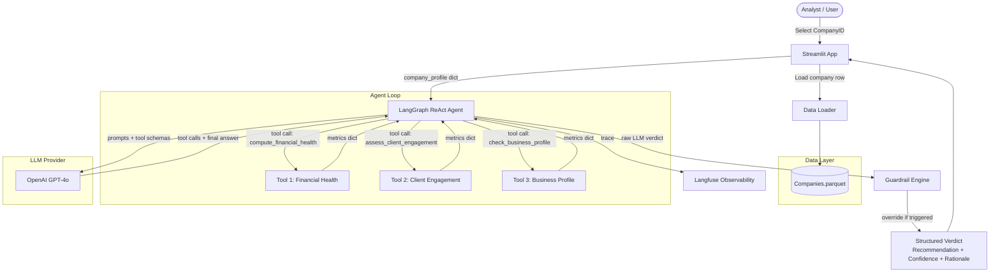

# Solution Blueprint: LLM-Powered Credit Assessment Agent

## 1. Problem Statement

Liquidity's credit team manually evaluates company applications for growth capital by aggregating signals across financial performance, client engagement, and business health — a slow, inconsistent process. The goal is an LLM-powered agent that ingests a structured company profile (from `Companies.parquet`), invokes domain-specific tools to compute credit signals, and produces a structured verdict: **Recommendation** (Continue / Review / No-Go), **Confidence** (low / medium / high), and a **natural-language rationale**. At least one hard rule-based guardrail must override the LLM regardless of its output. The solution is delivered as a Streamlit app. This blueprint does **not** cover model training, user authentication, or multi-tenant data isolation.

---

## 2. AI Approach

**Chosen approach:** ReAct-style LLM agent with structured tool calling (OpenAI function calling / tool-use API)

The agent follows a **Reason → Act → Observe** loop: it is given a company profile and a set of tools, reasons about which signals to gather, calls the appropriate tools, observes their outputs, and synthesizes a final verdict. This is not a RAG system (no document retrieval needed) and not a fine-tuned model (insufficient labelled credit decisions for supervised learning). It is a structured reasoning agent over tabular signals.

**Why this approach:**
- The assessment task is explicitly multi-step reasoning ("compute X, then interpret X in the context of Y") — this maps exactly to what ReAct agents do well.
- Explainability is a hard requirement. Tool outputs are visible in the agent trace, so every number cited in the rationale is traceable to a specific computation.
- The data is structured and tabular — tools can deterministically compute derived metrics, keeping the LLM focused on judgment rather than arithmetic.
- A guardrail that overrides the LLM is naturally modelled as a post-processing step after tool results are collected, independent of the LLM's reasoning.

**Approaches considered and ruled out:**

| Approach | Why ruled out |
|---|---|
| Pure rule-based scoring | Too brittle — fixed thresholds can't generalise across business types, geographies, or edge cases without extensive tuning |
| Fine-tuned classifier | No labelled credit decision dataset; supervised learning requires historical approved/rejected outcomes we don't have |
| RAG over documents | No unstructured documents in scope — all signals are computable from structured fields |
| Chain-of-Thought prompting only (no tools) | Asks the LLM to do arithmetic and ratio computation on raw numbers — unreliable; tools make this deterministic |
| AutoML predictive model | Would produce a score but not an auditable rationale; analysts need to understand *why*, not just a probability |

---

## 3. System Architecture



**Architecture narrative:**
The Streamlit app loads a company row from the parquet file and passes it as a dictionary to a LangGraph ReAct agent. The agent calls three deterministic Python tools to compute financial, engagement, and profile signals, then asks GPT-4o to synthesize these into a structured verdict. Before returning to the UI, the Guardrail Engine applies hard rule checks and overwrites the verdict if any trigger fires. Every LLM call is traced to Langfuse for auditability.

---

## 4. Component Breakdown

### Streamlit App (`app/streamlit_app.py`)
- **Role:** User-facing interface — company selector, agent trigger, result display
- **Technology:** Streamlit 1.35
- **Why:** Required by the exercise; fastest path to a clean interactive UI with no frontend build step
- **Key interfaces:** Reads parquet via `DataLoader`, calls `CreditAgent.assess(company_id)`, renders `AssessmentResult` dataclass
- **Failure modes:** If the agent call hangs, the UI blocks — mitigated with `st.spinner` and a 60-second timeout

### Data Loader (`agent/data_loader.py`)
- **Role:** Loads and caches the parquet file; retrieves a single company row as a dict
- **Technology:** Pandas 2.2 + `@st.cache_data`
- **Why:** Parquet is the native format; pandas handles it with one line; Streamlit caching prevents reloads on every interaction
- **Key interfaces:** `get_company(company_id: str) → dict`, `list_company_ids() → list[str]`
- **Failure modes:** If the parquet file is missing or corrupt, fails fast with a clear error on app load

### LangGraph ReAct Agent (`agent/credit_agent.py`)
- **Role:** Orchestrates the multi-step tool-calling loop; constructs the system prompt; calls GPT-4o; parses the structured verdict
- **Technology:** LangGraph 0.2 (`create_react_agent` with tool binding) + `langchain-openai`
- **Why:** LangGraph's built-in ReAct loop handles tool dispatch, result injection, and loop termination without custom scaffolding; it also produces a traceable step-by-step log for display in the UI
- **Key interfaces:** `assess(company_profile: dict) → AssessmentResult` — where `AssessmentResult` has `recommendation`, `confidence`, `rationale`, `tool_outputs`, `guardrail_fired: bool`
- **Failure modes:** If GPT-4o is unavailable, raises `AgentError`; if the LLM returns malformed JSON, the parser retries once then raises

### Tool 1: Financial Health (`agent/tools/financial_health.py`)
- **Role:** Computes derived financial metrics from raw company fields
- **Technology:** Pure Python (no external deps)
- **Why:** Deterministic arithmetic must not be delegated to the LLM
- **Key interfaces:**
  - Input: `sales_main`, `sales_other`, `monthly_budget`, `investments`
  - Output: `{ revenue_estimate, budget_utilisation_ratio, revenue_per_investment, sales_mix_ratio }`
  - `revenue_estimate = sales_main + sales_other`
  - `budget_utilisation_ratio = revenue_estimate / monthly_budget` (revenue/budget; >1 = revenue covers budget)
  - `revenue_per_investment = revenue_estimate / max(investments, 1)`
  - `sales_mix_ratio = sales_main / max(sales_main + sales_other, 1)` (product concentration)
- **Failure modes:** Division by zero on zero-budget companies — handled with `max(..., 1)` guards; returns `null` values for missing fields

### Tool 2: Client Engagement (`agent/tools/client_engagement.py`)
- **Role:** Computes client retention, growth velocity, and visitor conversion metrics
- **Technology:** Pure Python
- **Why:** Retention and conversion rates are derived calculations the LLM should not compute inline
- **Key interfaces:**
  - Input: `todays_clients`, `returning_clients`, `total_active_clients`, `clients_7d`, `clients_6m`, `clients_12m`, `visitors_7d`, `visitors_6m`, `visitors_12m`
  - Output: `{ retention_rate, client_growth_rate_6m, client_growth_rate_12m, conversion_rate_7d, visitor_trend_ratio, active_client_ratio }`
  - `retention_rate = returning_clients / max(todays_clients, 1)`
  - `client_growth_rate_6m = (clients_6m - clients_12m/2) / max(clients_12m/2, 1)` (annualised approximation)
  - `conversion_rate_7d = clients_7d / max(visitors_7d, 1)`
  - `active_client_ratio = total_active_clients / max(todays_clients, 1)`
- **Failure modes:** Returns zeroes for null visitor/client fields with a `data_quality_flag` in the output

### Tool 3: Business Profile (`agent/tools/business_profile.py`)
- **Role:** Surfaces qualitative risk signals from categorical and temporal fields
- **Technology:** Pure Python + a small risk-tier lookup dict for `PrimaryType`
- **Why:** Business type risk tiering and company age are interpretive signals the LLM should receive pre-computed, not reason about from raw strings
- **Key interfaces:**
  - Input: `company_status`, `primary_type`, `year_founded`, `origin_country`, `rank`
  - Output: `{ company_age_years, status_flag, business_type_risk_tier, rank_band, country }`
  - `company_age_years = current_year - year_founded`
  - `status_flag`: `"active"` / `"inactive"` / `"suspended"` / `"closed"` (normalised)
  - `business_type_risk_tier`: `"low"` / `"medium"` / `"high"` based on lookup table
  - `rank_band`: `"strong"` (>4.0) / `"acceptable"` (3.0–4.0) / `"weak"` (<3.0)
- **Failure modes:** Unknown `PrimaryType` values default to `"medium"` risk tier with a logged warning

### Guardrail Engine (`agent/guardrails.py`)
- **Role:** Applies hard rule-based checks after tool outputs are collected; overrides the LLM verdict if any rule fires
- **Technology:** Pure Python, rule functions returning `GuardrailResult(fired: bool, reason: str)`
- **Why:** Hard rules must be deterministic, auditable, and LLM-agnostic — not softened by the model's reasoning
- **Key interfaces:** `run_guardrails(tool_outputs: dict, llm_verdict: AssessmentResult) → AssessmentResult`
- **Failure modes:** Rules execute sequentially; a failure in one rule is caught and logged, not silently swipped

### Langfuse Observability (`agent/observability.py`)
- **Role:** Traces every LLM call, tool invocation, and final verdict for audit and drift detection
- **Technology:** Langfuse Python SDK 2.x + LangChain callback handler
- **Why:** First-class LLM observability tool with trace-level visibility into tool calls, latency, and token costs; purpose-built for LLM audit trails
- **Key interfaces:** Wraps the LangGraph agent via `CallbackHandler`; no changes to agent code needed
- **Failure modes:** If Langfuse is unreachable, the agent continues — tracing is non-blocking

---

## 5. Data Flow

### Primary happy-path: analyst assesses a company

1. Analyst opens the Streamlit app and selects a `CompanyID` from the dropdown.
2. App calls `DataLoader.get_company(company_id)` → returns the raw row as a Python dict.
3. App calls `CreditAgent.assess(company_profile)`.
4. The LangGraph agent constructs a system prompt embedding the company profile and the tool schemas, then sends a first message to GPT-4o.
5. GPT-4o returns a tool call for `compute_financial_health` with the relevant fields extracted from the profile.
6. LangGraph executes `financial_health.run(...)` → returns a metrics dict.
7. GPT-4o receives the tool output, then calls `assess_client_engagement` — LangGraph executes and returns engagement metrics.
8. GPT-4o calls `check_business_profile` — LangGraph executes and returns profile risk signals.
9. GPT-4o receives all three tool outputs and produces a final structured response: `{ recommendation, confidence, rationale }`.
10. The Guardrail Engine runs all hard rules against the combined tool outputs.
11. If a guardrail fires, it overwrites `recommendation` to `"No-Go"`, sets `confidence` to `"high"`, appends a guardrail notice to `rationale`, and sets `guardrail_fired = True`.
12. The `AssessmentResult` is returned to the Streamlit app.
13. The app renders: recommendation badge, confidence level, rationale paragraph, expandable tool output table, and a guardrail warning banner (if fired).
14. The full trace is sent asynchronously to Langfuse.

### Secondary flow: guardrail override path

Steps 1–9 are identical. At step 10, the Guardrail Engine detects that `status_flag == "closed"` (or another trigger — see Section 4). It sets `recommendation = "No-Go"`, prepends `"[GUARDRAIL OVERRIDE]"` to the rationale, and marks `guardrail_fired = True`. The Streamlit UI shows a red warning banner explaining which rule fired.

---

## 6. Guardrail Design

### Chosen Guardrail: Company Status Hard Stop

**Rule:** If `CompanyStatus` maps to `status_flag` of `"inactive"`, `"suspended"`, or `"closed"` → override recommendation to `"No-Go"` with `confidence = "high"`.

**Rationale:** A company that is not operationally active cannot service growth capital. No amount of strong historical revenue or client metrics overrides the fundamental inability to operate. This is the single clearest bright-line rule in the dataset — `CompanyStatus` is a direct indicator, not an inferred signal. Any LLM reasoning that reaches "Continue" or "Review" for a closed company is a hallucination that must be suppressed.

**Threshold:** Binary — any non-active status triggers it. There is no grey zone; "inactive" is not a lesser version of "active."

### Secondary Guardrail: Extreme Budget Burn

**Rule:** If `budget_utilisation_ratio < 0.1` (i.e., revenue covers less than 10% of the monthly budget) → override to `"No-Go"`.

**Rationale:** A company spending 10× its revenue cannot repay growth capital. The 10% threshold is conservative — even accounting for seasonal dips, a company with <10% revenue/budget coverage is structurally insolvent for lending purposes. This guardrail catches cases where the LLM may be swayed by strong client engagement metrics despite catastrophic unit economics.

---

## 7. Tech Stack

| Layer | Technology | Version / Notes |
|---|---|---|
| Language | Python | 3.12 |
| LLM | OpenAI GPT-4o | `gpt-4o-2024-08-06`; structured outputs via `response_format` JSON schema |
| Agent orchestration | LangGraph | 0.2.x — `create_react_agent` for ReAct loop |
| LLM client | `langchain-openai` | 0.1.x — wraps OpenAI SDK for LangGraph compatibility |
| Data | Pandas | 2.2 — parquet loading via `pyarrow` |
| UI | Streamlit | 1.35 — zero-build interactive app |
| Observability | Langfuse | 2.x Python SDK — LLM trace + audit log |
| Config | `python-dotenv` | 1.0 — environment variable management |
| Testing | pytest | 8.x — unit tests for tools and guardrails |
| Packaging | `uv` | 0.4 — fast dependency management |

---

## 8. Implementation Roadmap

### Phase 1 — Data + Tool Layer (Days 1–2)
- Load `Companies.parquet` with `DataLoader`; verify all 20 fields are present and explore null rates
- Implement all three tool modules with unit tests against known inputs
- Implement `GuardrailEngine` with both rules and their unit tests
- **Done when:** `pytest agent/tools/ agent/guardrails.py` passes with 100% coverage on happy paths and edge cases (zero division, null fields, unknown business types)

### Phase 2 — Agent Core (Days 3–4)
- Write the system prompt template with company profile injection
- Wire LangGraph `create_react_agent` with the three tools and GPT-4o
- Implement `AssessmentResult` dataclass and the JSON output parser
- Run the agent manually on 5 company profiles; inspect traces in the terminal
- **Done when:** Agent produces valid `AssessmentResult` for all 5 test companies; guardrail override fires correctly for the "closed" status test case

### Phase 3 — Streamlit UI (Day 5)
- Build `streamlit_app.py`: sidebar company selector, "Run Assessment" button, result display with recommendation badge, confidence chip, rationale text, tool output expander, guardrail banner
- Wire Langfuse callback handler
- **Done when:** App runs with `streamlit run app/streamlit_app.py`; analyst can assess any company end-to-end in the UI; guardrail banner appears for override cases

### Phase 4 — Hardening + Documentation (Day 6)
- Add retry logic (3 attempts with exponential backoff) for OpenAI calls
- Add 60-second agent timeout with graceful error display in UI
- Write `MINI_REPORT.md` addressing guardrail design, evaluation, and production monitoring
- Record 3 example assessments in the report (one guardrail override case)
- **Done when:** App handles OpenAI downtime gracefully; `MINI_REPORT.md` is complete; `README.md` has setup and run instructions

---

## 9. Code Generation Guide

### Repository Structure

```
ds-assignment/
├── Companies.parquet               # Source data (do not commit to git if sensitive)
├── README.md                       # Setup and run instructions
├── MINI_REPORT.md                  # Guardrail design, evaluation, monitoring report
├── SOLUTION_BLUEPRINT.md           # This document
├── pyproject.toml                  # uv/pip project config
├── .env.example                    # Environment variable template
├── .env                            # Actual secrets (gitignored)
│
├── app/
│   └── streamlit_app.py            # Streamlit UI entrypoint
│
├── agent/
│   ├── __init__.py
│   ├── credit_agent.py             # LangGraph ReAct agent
│   ├── data_loader.py              # Parquet loader + company getter
│   ├── guardrails.py               # Hard rule engine
│   ├── models.py                   # AssessmentResult dataclass + enums
│   ├── observability.py            # Langfuse setup and callback
│   ├── prompts.py                  # System prompt template
│   └── tools/
│       ├── __init__.py
│       ├── financial_health.py     # Tool 1
│       ├── client_engagement.py    # Tool 2
│       └── business_profile.py    # Tool 3
│
└── tests/
    ├── test_financial_health.py
    ├── test_client_engagement.py
    ├── test_business_profile.py
    ├── test_guardrails.py
    └── test_agent_integration.py   # End-to-end with mocked LLM
```

### Build Order

Build in this sequence — each step is independently testable before the next begins:

1. **`agent/models.py`** — Define `Recommendation` enum (`CONTINUE`, `REVIEW`, `NO_GO`), `Confidence` enum (`LOW`, `MEDIUM`, `HIGH`), `GuardrailResult(fired: bool, rule_name: str, reason: str)`, `AssessmentResult(recommendation, confidence, rationale, tool_outputs, guardrail_fired, guardrail_reason, steps)` dataclass

2. **`agent/data_loader.py`** — `DataLoader` class: `__init__(path)` loads parquet into a pandas DataFrame; `get_company(company_id)` returns a row dict; `list_company_ids()` returns sorted list; `get_sample_companies(n=3)` returns a representative sample for demo purposes

3. **`agent/tools/financial_health.py`** — `compute_financial_health(sales_main, sales_other, monthly_budget, investments) -> dict`. Compute: `revenue_estimate`, `budget_utilisation_ratio`, `revenue_per_investment`, `sales_mix_ratio`. All inputs can be None — return `None` for the metric and set `"data_quality_issues": ["missing: monthly_budget"]`. Decorate with `@tool` from `langchain_core.tools`.

4. **`agent/tools/client_engagement.py`** — `assess_client_engagement(todays_clients, returning_clients, total_active_clients, clients_7d, clients_6m, clients_12m, visitors_7d, visitors_6m, visitors_12m) -> dict`. Compute retention rate, growth rates, conversion rate, visitor trend. Same null-handling pattern as Tool 1.

5. **`agent/tools/business_profile.py`** — `check_business_profile(company_status, primary_type, year_founded, origin_country, rank) -> dict`. Include a `BUSINESS_TYPE_RISK_MAP` dict at module level (populate with any types observed in the data; unknown types → `"medium"`). Compute `company_age_years` using `datetime.now().year`.

6. **`agent/guardrails.py`** — `GuardrailEngine` class with `run(tool_outputs: dict, verdict: AssessmentResult) -> AssessmentResult`. Implement two private rule methods: `_check_company_status(tool_outputs)` and `_check_budget_burn(tool_outputs)`. Rules are checked in order; first firing rule wins. Log which rule fired.

7. **`agent/prompts.py`** — `SYSTEM_PROMPT` string constant. The prompt should: (a) set the persona as an expert credit analyst, (b) instruct the agent to call all three tools before forming a verdict, (c) specify the JSON output schema `{ "recommendation": "Continue|Review|No-Go", "confidence": "low|medium|high", "rationale": "<200 words" }`, (d) list the signal priorities (status > financials > engagement > profile).

8. **`agent/credit_agent.py`** — `CreditAgent` class: `__init__()` binds tools to the GPT-4o model and creates a LangGraph `create_react_agent`; `assess(company_profile: dict) -> AssessmentResult` runs the agent loop, collects intermediate steps, parses the final JSON output, runs `GuardrailEngine.run()`, and returns the result. Implement 3-retry logic with `tenacity`.

9. **`agent/observability.py`** — `get_langfuse_handler()` returns a `LangfuseCallbackHandler` if `LANGFUSE_SECRET_KEY` is set, else returns `None`. The agent passes this to `config={"callbacks": [handler]}` if non-None.

10. **`app/streamlit_app.py`** — Layout: sidebar with `st.selectbox` for company ID and `st.button("Run Assessment")`; main area with `st.metric` for recommendation, `st.badge` for confidence, `st.markdown` for rationale, `st.warning` banner if guardrail fired, `st.expander("Tool Outputs")` showing a formatted table of all computed metrics, `st.expander("Agent Reasoning Steps")` showing the LangGraph step trace.

11. **`tests/`** — Unit tests for each tool (test null inputs, zero-division, edge values), guardrail tests (test both rules firing and not firing), integration test with a mocked LLM that returns a known JSON payload.

### Key Implementation Notes

- **The LLM must always call all three tools** — enforce this in the system prompt: "You MUST call compute_financial_health, assess_client_engagement, and check_business_profile before forming any verdict. Do not answer without all three tool results." Without this, the agent may short-circuit to a verdict after one tool call.
- **Parse the final LLM output with `response_format`** — use OpenAI's structured output feature (`response_format={"type": "json_schema", ...}`) rather than prompt-engineering JSON output. This eliminates malformed JSON errors entirely.
- **Guardrail runs on tool outputs, not LLM outputs** — the guardrail should read `tool_outputs["business_profile"]["status_flag"]` and `tool_outputs["financial_health"]["budget_utilisation_ratio"]`, not parse the LLM's rationale text. This makes it fully deterministic.
- **Streamlit caches the DataLoader** — use `@st.cache_resource` on the DataLoader instantiation, not `@st.cache_data`, because it holds a mutable DataFrame.
- **Never log raw company profiles to stdout** — they may contain PII-adjacent financial data. Log only `company_id` and the final recommendation.
- **The parquet file path should be configurable** — read it from `DATA_PATH` env var with a sensible default of `./Companies.parquet`, so the app works from any working directory.
- **LangGraph step trace for the UI** — after `agent.invoke()`, extract `result["messages"]` and filter for `ToolMessage` instances to build the reasoning steps display. Each tool call should show: tool name, inputs, outputs summary.

### Environment Variables

```bash
# .env
OPENAI_API_KEY=              # Required — get from platform.openai.com
OPENAI_MODEL=gpt-4o-2024-08-06  # Optional override

LANGFUSE_SECRET_KEY=         # Optional — get from cloud.langfuse.com
LANGFUSE_PUBLIC_KEY=         # Optional — paired with secret key
LANGFUSE_HOST=https://cloud.langfuse.com  # Optional — default shown

DATA_PATH=./Companies.parquet  # Optional — path to parquet file
```

### Quick-Start Commands

```bash
# Install dependencies (using uv)
pip install uv
uv venv && source .venv/bin/activate   # Windows: .venv\Scripts\activate
uv pip install langchain-openai langgraph langfuse streamlit pandas pyarrow tenacity python-dotenv pytest

# Copy and fill in environment variables
cp .env.example .env
# Edit .env and set OPENAI_API_KEY

# Run tests
pytest tests/ -v

# Run Streamlit app
streamlit run app/streamlit_app.py
```

---

## 10. Mini Report Answers

### How did you decide on the guardrail and threshold?

**Guardrail 1 (Company Status):** This is the clearest categorical bright line in the dataset. A company with status "inactive", "suspended", or "closed" has no operational capacity to use or repay growth capital. The threshold is binary (active vs. non-active) because there is no meaningful grey zone — an LLM that recommends "Continue" for a closed company is producing a dangerous error that must be suppressed, not softened.

**Guardrail 2 (Budget Burn):** A `budget_utilisation_ratio < 0.1` means the company's revenue covers less than 10% of its stated monthly budget. This is structurally insolvent for lending purposes. The 10% threshold is conservative and could be tuned upward (e.g., 20–30%) based on analyst feedback; the architecture supports this via a configurable constant.

### How would you evaluate whether the agent is making good decisions at scale?

- **Offline evaluation set:** Sample 50–100 companies and have senior analysts label them manually. Run the agent on the same set. Measure precision/recall for each recommendation class.
- **Agreement rate:** Track what fraction of agent "Continue" decisions analysts override to "No-Go" (and vice versa). A high override rate signals systematic drift.
- **Rationale quality scoring:** Use a separate LLM as a judge (GPT-4o with a rubric) to score each rationale for factual accuracy, signal coverage, and coherence on a 1–5 scale.
- **Guardrail fire rate:** Monitor what % of assessments trigger a guardrail. A sudden spike suggests data quality issues; a prolonged zero rate suggests the guardrail may have become irrelevant.
- **A/B cohort study:** If agents are deployed alongside human analysts, compare default rates on loans approved by each — the gold-standard outcome metric.

### What would you monitor in production to detect drift or untrustworthy outputs?

| Signal | Tool | Alert Condition |
|---|---|---|
| Recommendation distribution | Langfuse + custom dashboard | >20% shift in Continue/Review/No-Go share week-over-week |
| Guardrail override rate | Langfuse custom metric | Spike >3σ above baseline |
| Rationale length | Langfuse metadata | Rationales consistently <50 words (LLM shortcuts) or >500 words (hallucination verbosity) |
| Tool call completion | Langfuse trace | Agent completes <3 tool calls — prompt drift or model change |
| LLM latency p95 | Langfuse + OpenAI dashboard | >10s p95 latency — model degradation or traffic spike |
| Input data quality | DataLoader metrics | Null rate spike in key fields (signals upstream data pipeline issues) |
| Analyst override rate | Application DB | >30% of agent verdicts overridden by analysts in a rolling 7-day window |
| Token cost per assessment | OpenAI usage API | >2× baseline cost — runaway loop or prompt injection |
